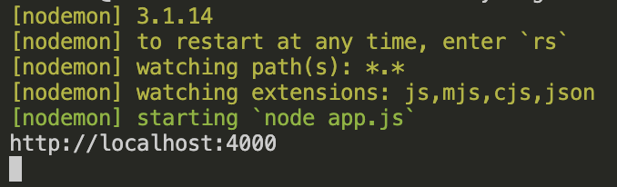

# DenUsynligeSekken

[Trykk her for å gå til Den Usynlige Sekken](https://denusynligesekken.mineelever.no/)


## Hva løsningen gjør
Den usynlige sekken er en webapplikasjon som lar brukeren legge til forskjellige ting i hverdagen som brukeren føler er en belastning i hverdagen som kan vises visuelt som en sekk som blir tyngre for hver ting som blir lagt til. Hver belastning har en gitt verdi og blir lagt til en total verdi ut ifra hva brukeren velger. Brukeren kan legge til, fjerne og reset alle belastningene ut ifra eget valg. Applikasjonen krever ingen innlogging, og brukernes opplysninger lagres ikke. Dette gjør at løsningen kan brukes anonymt.

## Fordeling av oppgaver
Vi hadde fordelt oppgaver slik at alle fikk de områdene de var best i! Even sto bak mye av styling, Lukas med universell utforming og Andreas med mye JavaScript. Alle har vært bort hverandres oppgaver også for å komme med innspill. Even var prosjekt leder og er eier repositoriet!


## Hvilke teknologier som brukes

### Prosjektet bruker:

Node.js, Express, EJS, JavaScript og CSS, GitHub, Git og Visual Studio Code (VS Code)

## Hvordan prosjektet installeres   


#### Forhåndsjekk:
- Sjekk om Node.js er installert 
- Sjekk om Git er installert
- Sjekk om at du har et programmeringsprogram installert som for eksempel Visual Studio Code

#### Kontroller versjoner:
- Skriv dette for å sjekke node: 
```bash
node -v
```

- Skriv dette for å sjekke Git:
```bash
git --version
``` 
#### Git clone
1. Opprett en mappe
2. Åpne Visual Studio Code 
3. Gå til terminal
4. Skriv inn følgende kommando:
```bash
git clone https://github.com/Hoppsann/DenUsynligeSekken
```


### Installer nødvendige pakkene ved bruk av npm
1. Gå inn på Visual Studio Code og gå til terminalen 
2. Skriv inn inn følgende kommando for å installere alle pakkene i JSON-filen som følger med når du kloner av repository
```bash
npm install
```

3. Hvis ikke npm install funket må du skrive inn følgende kommandoer:
```bash
npm install express
```
og

```bash
npm install nodemon
```


## Hvordan prosjektet startes
1. Gå til terminalen 
2. Skriv inn:
```bash
nodemon app.js
```

for å starte serveren

3. Gå til din nettleser og skriv inn: 

```bash
http://localhost:4000
```
Vi bruker port 4000 på dette prosjektet.

4. Nettsiden skal nå være tilgjengelig

## Hvilke tjenester som må være tilgjengelig
For at man skal kunne kjøre serveren lokalt på PC-en må du ha følgende tilgjengelig:
1. Node.js - Dette brukes til å kjøre serveren / prosjektet ditt
2. Git - Git må være installert  dersom prosjektet skal hentes fra GitHub repository ved bruk av git clone
3. Visual Studio Code eller annet programmerings program


## Feilsøking 

Det kan oppstå problemer og da er det viktig at man sjekker følgende ting:

### Sjekk om Node.js og git er installert
 
 Kjør følgende kommando i terminalen:
```bash
    node -v
```
Hvis terminalen ikke viser eller finner node må Node.js installeres

---

### Sjekk om de nødvendige pakkene er installert

Kjør følgende kommando i terminalen:
```bash
    npm install
```

Dette vil installere de pakkene som ligger i package.json når du cloner prosjektet med git

---

### Sjekk om du er i riktig mappe

Dette kan du teste ved å gå inn i terminalen og skrive in følgende kommando:

```bash
    ls
```

### Kontroller at serveren kjører
 Når du kjører følgende kommando i terminalen:
 ```bash
    nodemon app.js
```

Skal terminalen vise følgende ved oppstart av serveren:



Hvis serveren stopper og du får en feilmelding, da må du lese feilmeldingen

### Kontroller port

Kontroller at porten i app.js stemmer overens med nettadressen som er oppgitt i nettleseren.

Hvis prosjektet bruker port 4000, da må nettadressen være følgende:

```bash
    http://localhost:4000
```

### Start serveren på nytt

Hvis serveren oppfører seg rart eller uventet kan du stoppe serveren med:

<u>Windows</u>: Ctrl + C

<u>Mac</u>: Control + C


Start serveren deretter på igjen med følgende kommando i terminalen:

```bash
    nodemon app.js
```